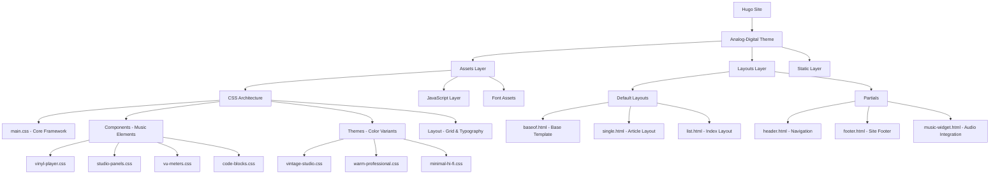
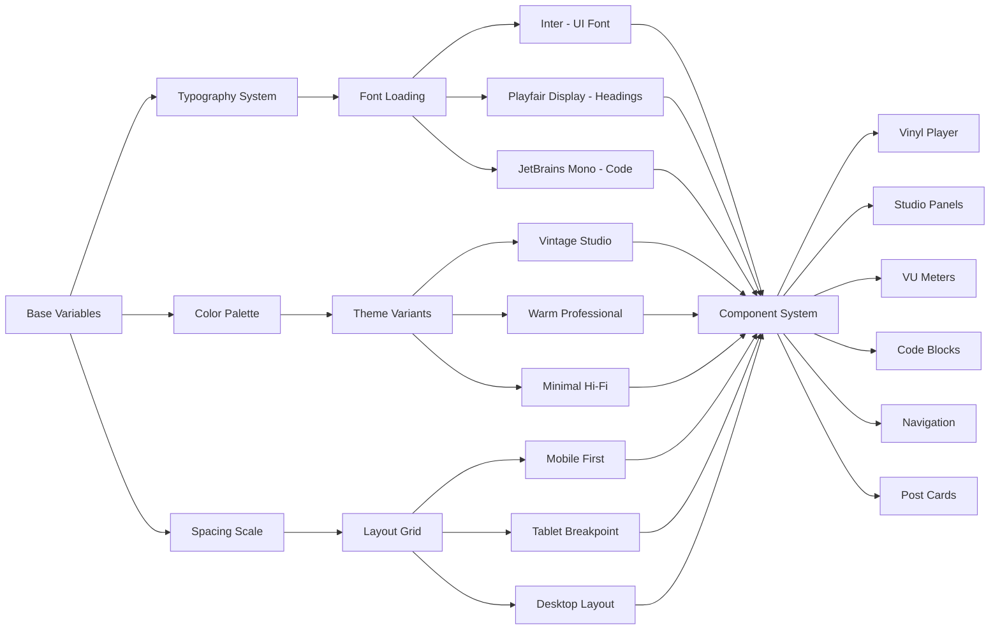
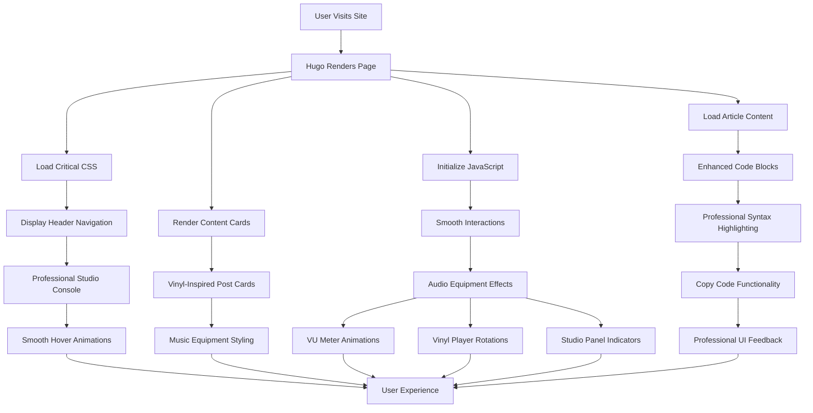
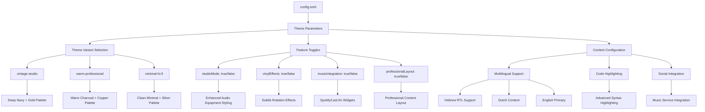
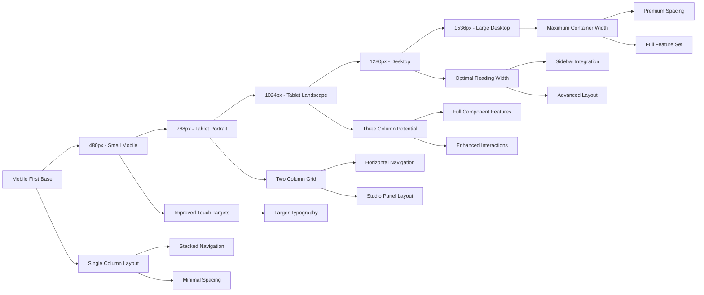
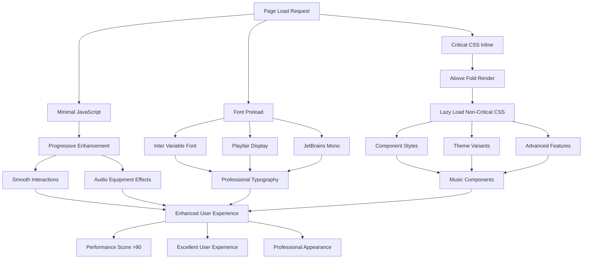
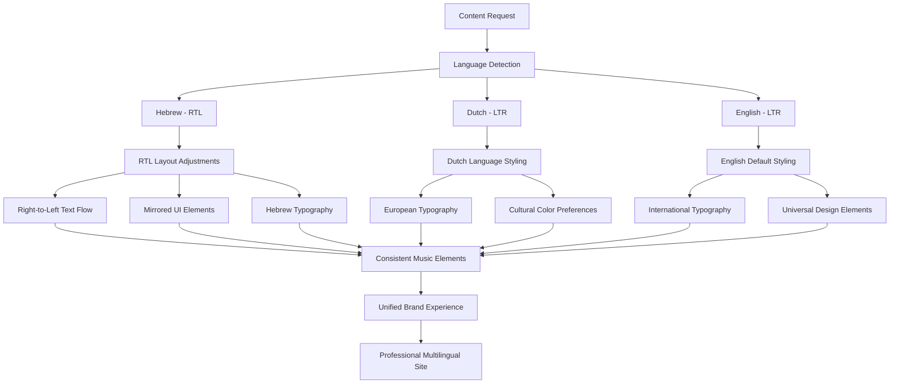

# Architecture Diagrams
## Analog-Digital Theme Structure and Implementation Flow

### Theme Architecture Overview

### CSS Architecture Flow

### Implementation Flow Timeline

```mermaid
gantt
    title Theme Transformation Timeline
    dateFormat X
    axisFormat %s

    section Phase 1: Foundation
    Remove Cyberpunk Effects    :done, foundation1, 0, 1
    Implement Color System      :done, foundation2, 1, 2
    Update Typography          :done, foundation3, 2, 3
    Clean Base Styles          :done, foundation4, 3, 4

    section Phase 2: Components
    Redesign Navigation        :active, components1, 4, 6
    Create Post Cards          :components2, 6, 8
    Implement VU Meters        :components3, 8, 10
    Studio Panel Styling       :components4, 10, 12

    section Phase 3: Music Features
    Vinyl Player Component     :music1, 12, 14
    Audio Equipment Panels     :music2, 14, 16
    Music Integration          :music3, 16, 18
    Interactive Elements       :music4, 18, 20

    section Phase 4: Content
    Advanced Code Blocks       :content1, 20, 22
    Typography Enhancement     :content2, 22, 24
    Technical Content          :content3, 24, 26
    Multilingual Support       :content4, 26, 28

    section Phase 5: Polish
    Responsive Design          :polish1, 28, 30
    Performance Optimization   :polish2, 30, 32
    Quality Assurance          :polish3, 32, 34
    Final Testing              :polish4, 34, 36
```

### Component Interaction Flow

### Theme Configuration Flow

### Responsive Design Breakpoints

### Performance Optimization Flow

### Multilingual Content Support

These diagrams provide a comprehensive visual representation of the theme architecture, implementation flow, and technical considerations for transforming the cyberpunk theme into the sophisticated Analog-Digital design concept.