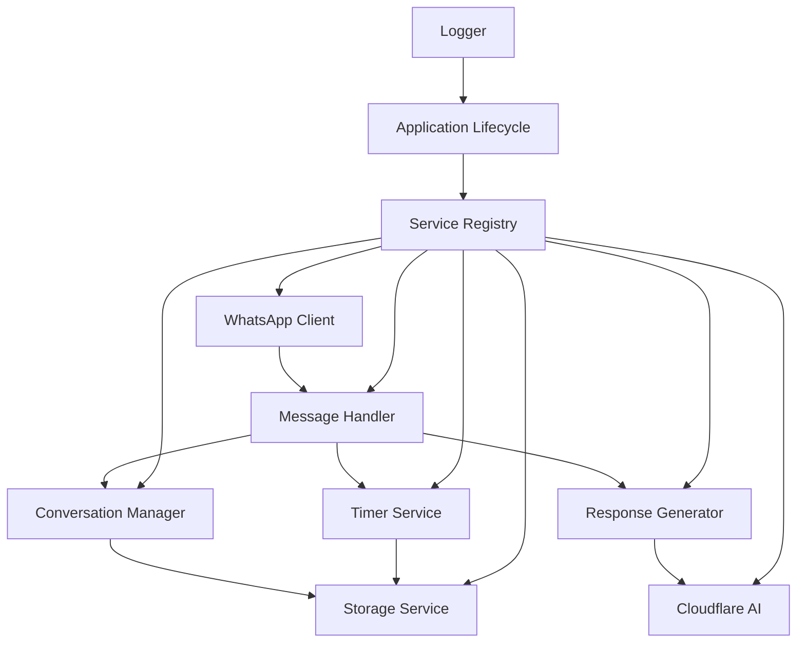

Hey there! 👋

So I had this crazy idea: what if I could build an AI assistant for WhatsApp that doesn't just spam responses, but actually behaves like a smart secretary? You know, someone who understands context, knows when to speak up, and maintains professional boundaries.

Turns out, it's totally doable with Cloudflare Workers AI. Here's how I did it.

## 🎯 The Problem I Wanted to Solve

Most chatbots are... well, annoying. They respond to everything immediately, have zero context awareness, and feel completely robotic. I wanted something different:

- ✅ **Actually intelligent** - understands conversation flow
- ✅ **Professional timing** - doesn't spam responses
- ✅ **Context-aware** - remembers what we talked about
- ✅ **Group chat smart** - adapts behavior appropriately

## 🚀 What Makes This Different

### Secretary-Style Intelligence
Instead of building another basic chatbot, I focused on professional behavior:

```typescript
interface ConversationContext {
    chatId: string;
    participantCount: number;
    recentMessages: WhatsAppMessage[];
    lastResponseTime?: number;
    isActive: boolean;
}
```

**Key features:**
- 🔸 **Context memory** - references previous conversations
- 🔸 **Smart timing** - 2-minute delays + 5-hour cooldowns
- 🔸 **Urgency detection** - prioritizes important messages
- 🔸 **Professional tone** - appropriate for business use

### Cloudflare Workers AI Integration
Using **llama-3.2-1b-instruct** with some smart optimizations:

- 🔸 **Retry logic** with exponential backoff
- 🔸 **Rate limit monitoring** (super important!)
- 🔸 **Health checks** for reliability
- 🔸 **Model switching** ready for future upgrades

## ⚙️ Technical Architecture

I built this with clean, modular design using dependency injection:



### Core Components That Matter

**Service Registry** - Dependency injection with health monitoring:
```typescript
class ServiceRegistry extends EventEmitter {
    private services: Map<string, any> = new Map();
    private healthStatus: Map<string, ServiceHealth> = new Map();
    // Handles the entire service lifecycle
}
```

**Enhanced Logging** - Structured logs with correlation IDs:
```typescript
class Logger {
    private correlationId: string;
    private formatMessage(level: string, message: string, context?: any): string {
        return JSON.stringify({
            timestamp: new Date().toISOString(),
            level: level.toUpperCase(),
            correlationId: this.correlationId,
            message,
            ...(context && { context })
        });
    }
}
```

**Smart Timer Management** - Handles delays and cooldowns:
```typescript
interface TimerState {
    chatId: string;
    responseTimer?: NodeJS.Timeout;
    cooldownTimer?: NodeJS.Timeout;
    lastResponseTime?: number;
    isInCooldown: boolean;
}
```

## 🐳 Docker Deployment (ARM64 Ready!)

The whole thing runs perfectly in Docker, optimized for both ARM64 and AMD64:

```yaml
services:
  whatsapp-llm-pa:
    build: .
    environment:
      - CLOUDFLARE_API_TOKEN=${CLOUDFLARE_API_TOKEN}
      - CLOUDFLARE_ACCOUNT_ID=${CLOUDFLARE_ACCOUNT_ID}
    volumes:
      - whatsapp_data:/app/data
      - whatsapp_sessions:/app/sessions
      - whatsapp_logs:/app/logs
    restart: unless-stopped
```

**Production features that actually work:**
- 🔸 **Health monitoring** with auto-recovery
- 🔸 **Memory leak detection** and prevention
- 🔸 **Graceful shutdown** (no data loss!)
- 🔸 **Comprehensive error handling**
- 🔸 **SQLite persistence** with backups

## 📊 Monitoring & Observability

Real-time insights into everything:

```typescript
interface AppMetrics {
    uptime: number;
    startTime: number;
    services: Record<string, ServiceHealth>;
    memory: {
        used: number;
        total: number;
        percentage: number;
    };
    conversations: {
        active: number;
        total: number;
        messages: number;
    };
    timers: {
        active: number;
        cooldowns: number;
        responses: number;
    };
}
```

**What I monitor:**
- 🔸 **Health checks** every 30 seconds
- 🔸 **Memory usage** (alerts at 80%)
- 🔸 **AI service status** with rate limits
- 🔸 **Conversation statistics**

## 🔒 Security & Privacy First

Built with privacy in mind from day one:

- 🔸 **No sensitive data logging**
- 🔸 **Rate limiting** to prevent abuse
- 🔸 **Content filtering** for appropriate responses
- 🔸 **Encryption at rest**
- 🔸 **Authentication failure handling**

## 💡 Smart Technical Decisions

### TypeScript Everything
Complete type safety across the entire codebase:
- Better IDE support
- Self-documenting interfaces
- Compile-time error catching
- Easier refactoring

### Event-Driven Architecture
Clean separation using EventEmitter pattern:
```typescript
interface WhatsAppClientEvents {
    'message': (message: WhatsAppMessage) => void;
    'ready': () => void;
    'qr': (qrCode: string) => void;
    'authenticated': () => void;
    'auth_failure': (message: string) => void;
    'disconnected': (reason: string) => void;
    'error': (error: Error) => void;
}
```

### Performance Optimizations
**Memory management that works:**
- 🔸 **Auto cleanup** after 24 hours
- 🔸 **Message limiting** (10 messages max)
- 🔸 **Timer cleanup** prevents memory leaks
- 🔸 **Garbage collection monitoring**

**Chrome optimization for containers:**
```dockerfile
# ARM64-specific optimizations
RUN apt-get update && apt-get install -y \
    chromium \
    --no-install-recommends

ENV CHROME_ARGS="--no-sandbox --disable-dev-shm-usage --single-process --disable-gpu"
```

## 🚀 Want to Try It?

Super easy setup:

```bash
git clone git@github.com:evilUrge/whatsapp-llm-pa.git
cd whatsapp-llm-pa
cp .env.example .env
# Add your Cloudflare credentials
docker-compose up -d
```

**Requirements:**
- 🔸 **Cloudflare account** with Workers AI access
- 🔸 **Node.js 18+** for development
- 🔸 **Docker** for deployment

## 🔮 What's Next?

The modular design makes extending this really easy:

- 🔸 **Multi-model support** - OpenAI, Anthropic, etc.
- 🔸 **Voice message handling** - transcription + audio responses
- 🔸 **Image analysis** - understanding visual content
- 🔸 **Calendar integration** - smart scheduling
- 🔸 **Personality modes** - different personas for different contexts

## 💭 Lessons Learned

Building this taught me some important stuff:

1. **Context is everything** - The difference between good and great AI assistance is context awareness.

2. **Timing matters** - Human-like response timing is crucial. Too fast = robotic, too slow = unresponsive.

3. **Error handling saves lives** - In production, robust error handling isn't optional.

4. **Monitor everything** - You can't fix what you can't see.

5. **ARM64 Docker complexity** - Cross-platform containers need careful planning.

## 🎯 Final Thoughts

This project hits the sweet spot between AI capability and practical communication needs. The codebase is clean, well-documented, and perfect for:

- 🔸 **Learning AI integration**
- 🔸 **Exploring conversational AI**
- 🔸 **Understanding production Node.js**
- 🔸 **WhatsApp automation experiments**

**Tech Stack**: TypeScript, Node.js, WhatsApp Web.js, Cloudflare Workers AI, SQLite, Docker
**Model**: llama-3.2-1b-instruct
**License**: MIT

The future isn't about AI replacing human communication - it's about enhancing it with intelligent, contextual support.

Questions? Want to share your own AI assistant experiences? Hit me up!

Cheers,
Gilad